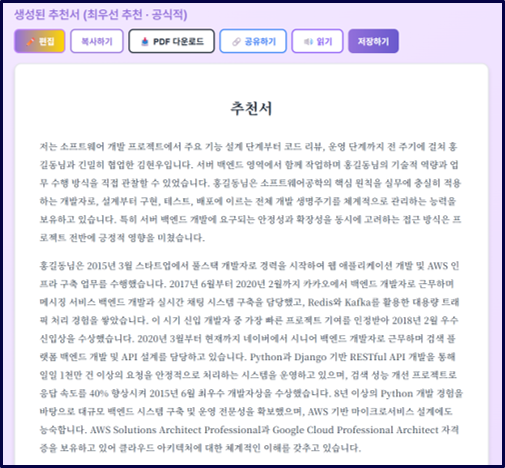
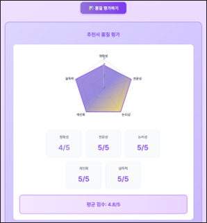

LLM 기반 개인화 추천서 생성 및 품질 평가 시스템 설계
---
**[개인화 추천서 자동 생성 AI]**

지원자의 역량을 평가하는 추천서를 개인 맞춤으로 자동으로 생성하고 평가하는 AI 시스템입니다.

**주요 기능**

-문체 학습 기반 개인화: TXT/DOCX/PDF 업로드 후 Claude API로 분석, 작성자 고유 문체 재현

-추천 강도 및 톤 조절: 1~5점 척도로 추천 강도 조절, 공식적/친근한/간결한/설득형 톤 선택 가능 → 20가지 이상 차별화된 추천서 생성

-품질 평가: GPT-4 기반 5가지 기준(정확성, 전문성, 논리성, 개인화, 설득력) 자동 평가 및 개선 제안

-환각 방지: 입력 정보만 사용하여 사실 기반 추천서 생성

---
**시스템 구성**
-프론트엔드: React 18.3
-백엔드: Python FastAPI
-데이터베이스: MySQL/PostgreSQL
-생성 엔진: Claude Sonnet 4.5 (문장 안정성 및 긴 문맥 처리)
-평가 엔진: GPT-4 (객관적 품질 평가)

---

**성능**
본 시스템 평균 점수: 4.72/5
범용 LLM 대비 문체 재현과 환각 방지에서 우수
사용자 테스트에서 90% 긍정 평가

---
**[실제 배포 화면]**
  

  

  

  

---
**[앱 배포화면]**

  

  
