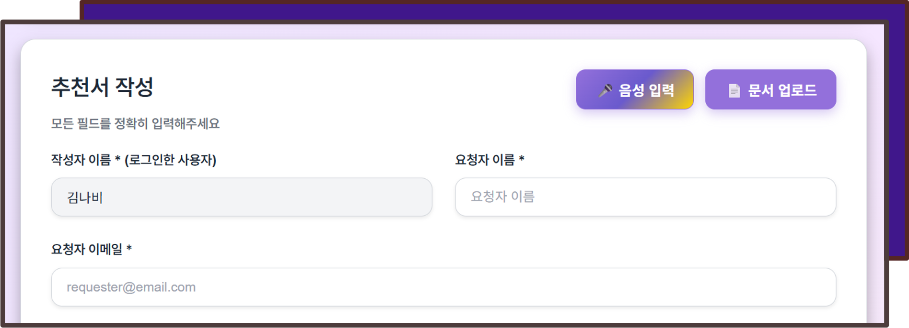
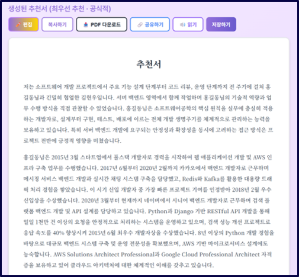
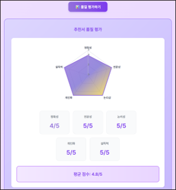

# LLM-based Recommendation Letter Generation & Evaluation

> An LLM-based recommendation letter generation system with prompt-based style control and automated evaluation.

본 프로젝트는 **기존 작성 문서에서 문체적 특성을 분석하고, 지원자 정보를 반영하여 추천서를 생성한 뒤 LLM을 활용해 생성 결과의 품질을 평가하는 시스템**입니다.

작성자 문서와 지원자 정보를 입력으로 받아 **Style Analysis → Prompt Construction → LLM Generation → Quality Evaluation**으로 이어지는 End-to-End LLM pipeline을 구현했습니다.

---

## Project Overview

### Motivation

LLM은 자연어 생성에 강점을 가지지만, 동일한 정보를 사용하더라도 **작성자의 문체나 원하는 표현 방식에 따라 생성 결과가 달라질 수 있습니다.**

본 프로젝트에서는 기존 작성 문서를 활용하여 작성자의 문체적 특성을 분석하고, 이를 prompt에 반영하여 추천서를 생성하는 방법을 구현했습니다.

또한 생성 모델과 별도의 평가 모델을 사용하여 생성된 추천서의 품질을 자동으로 평가하고, **LLM 기반 텍스트 생성 결과를 정량적으로 분석**했습니다.

---

## Objectives

* 기존 문서에서 작성자의 문체적 특성 분석
* 작성자 스타일 정보를 활용한 prompt 구성
* 지원자 정보를 반영한 추천서 생성
* LLM 기반 text generation pipeline 구현
* 생성 결과의 자동 품질 평가
* 생성 모델과 평가 모델을 분리한 evaluation pipeline 구축
* 입력 정보 기반의 사실 중심 생성 유도

---

## System Architecture

```text
Reference Documents
        ↓
Document Processing
        ↓
Writing Style Analysis
        ↓
Style Representation
        ↓
Candidate Information
        ↓
Prompt Construction
        ↓
Claude
        ↓
Generated Recommendation Letter
        ↓
GPT-based Evaluation
        ↓
Quality Scores
```

---

## Workflow

### 1. Reference Document Processing

사용자가 작성한 TXT, DOCX 또는 PDF 문서를 입력으로 받아 추천서 생성에 활용할 수 있도록 처리합니다.

입력 문서에서 작성자의 표현 방식과 문체적 특징을 분석하여 생성 과정에서 활용할 수 있는 형태로 구성했습니다.

---

### 2. Writing Style Analysis

기존 문서에서 나타나는 문체적 특성을 분석하고 이를 추천서 생성 prompt에 반영합니다.

이를 통해 단순히 지원자 정보를 입력하는 방식이 아니라 **reference document의 writing style을 generation 과정에 조건으로 제공**하도록 설계했습니다.

---

### 3. Prompt Construction

분석된 작성자 스타일과 지원자 정보를 결합하여 추천서 생성에 필요한 prompt를 구성합니다.

```text
Writing Style
      +
Candidate Information
      ↓
Prompt Construction
      ↓
Recommendation Letter
```

지원자 정보에 포함되지 않은 내용을 임의로 추가하지 않도록 생성 조건을 구성하여 **입력 정보에 기반한 text generation**을 유도했습니다.

---

### 4. LLM-based Generation

구성된 prompt를 **Claude Sonnet 4.5**에 전달하여 추천서를 생성합니다.

생성 과정에서는 작성자 스타일과 지원자 정보를 함께 고려하도록 prompt를 설계하여, 입력 문서의 문체적 특성과 지원자 정보를 동시에 반영할 수 있도록 했습니다.

---

### 5. Automated Quality Evaluation

생성된 추천서를 별도의 **GPT-4 기반 평가 모델**을 이용하여 자동으로 평가합니다.

| Evaluation Criteria |
| ------------------- |
| Accuracy            |
| Logicality          |
| Personalization     |
| Professionalism     |
| Persuasiveness      |

생성 모델과 평가 모델을 분리하여 **Generation → Evaluation**의 독립적인 평가 pipeline을 구성했습니다.

---

## Hallucination Mitigation

LLM 기반 텍스트 생성에서는 입력 정보에 존재하지 않는 내용을 생성하는 문제가 발생할 수 있습니다.

이를 줄이기 위해 추천서 생성 prompt에 **입력된 지원자 정보를 중심으로 작성하도록 제한하는 조건**을 포함했습니다.

이를 통해 생성 결과가 제공된 정보에서 벗어나지 않도록 유도하고, 추천서 생성 과정에서의 사실성 및 일관성을 높이는 것을 목표로 했습니다.

---

## Experimental Setup

| Component        | Technology         |
| ---------------- | ------------------ |
| Generation Model | Claude Sonnet 4.5  |
| Evaluation Model | GPT-4              |
| Frontend         | React 18.3         |
| Backend          | Python FastAPI     |
| Database         | MySQL / PostgreSQL |
| Language         | Python             |

---

## Results

생성된 추천서를 대상으로 LLM 기반 품질 평가와 사용자 테스트를 수행했습니다.

| Evaluation             |       Result |
| ---------------------- | -----------: |
| Average Quality Score  | **4.72 / 5** |
| Positive User Feedback |      **90%** |

평가 결과, 작성자 스타일과 지원자 정보를 반영한 추천서 생성 및 생성 결과의 전반적인 품질 평가에서 긍정적인 결과를 확인했습니다.

---

## My Contributions

* LLM-based recommendation letter generation pipeline 설계
* Reference document 기반 writing style analysis 설계
* Prompt construction 및 generation 조건 설계
* Claude API 연동 및 recommendation letter generation 구현
* GPT 기반 automated quality evaluation 구현
* Generation / Evaluation pipeline 설계
* Hallucination mitigation을 위한 prompt 조건 설계
* FastAPI backend 및 React frontend 개발

---

## Tech Stack

**LLM & Generative AI**

* Claude Sonnet 4.5
* GPT-4
* Prompt Engineering

**Backend**

* Python
* FastAPI

**Frontend**

* React 18.3

**Database**

* MySQL
* PostgreSQL

---

## System Screenshots

### Web








### App


